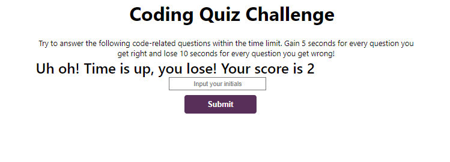
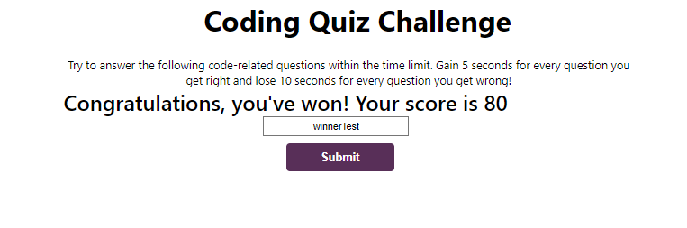
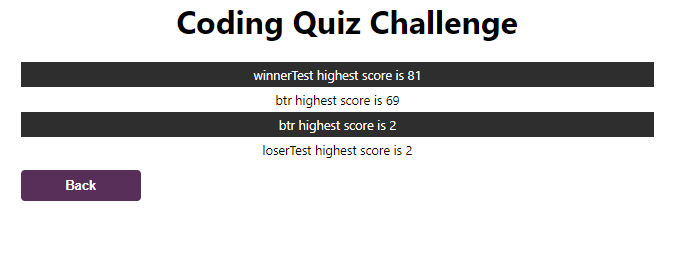

# Timed Quiz

## Description
This password generator was developed using JavaScript, HTML, and CSS. This application displays the ability to change elements without refreshing the page. It also displays the ability to properly save data to local storage.

## Installation
N/A

## Usage

## Credits
Thank you to MDN for the sort() function for the scoreboard feature
<https://developer.mozilla.org/en-US/docs/Web/JavaScript/Reference/Global_Objects/Array/sort>

## License

N/A

## Features

This quiz allows you to ask as many questions without having to make a ton of edits to the code
* contains calculations to create a score
* the ability to add initials to your score to show what you earned
* The ability to view previous scores, sorted from highest to lowest
* Would you like your password to contain numbers?
* Would you like your password to contain Symbols?